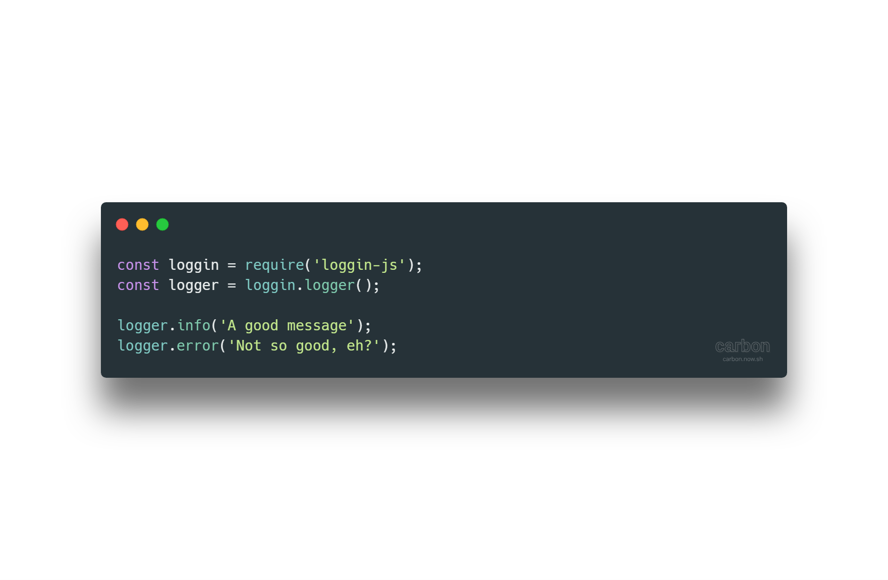

<!-- Links -->
[npm-image]: https://img.shields.io/npm/v/loggin-js.svg?style=flat-square
[npm-url]: https://npmjs.org/package/loggin-js

[travis-image]: https://img.shields.io/travis/nombrekeff/loggin-js.svg?style=flat-square
[travis-url]: https://travis-ci.org/nombrekeff/loggin-js

[code-quality-badge]: http://npm.packagequality.com/shield/loggin-js.svg?style=flat-square
[code-quality-link]: https://packagequality.com/#?package=loggin-js

[downloads-badge]: https://img.shields.io/npm/dm/loggin-js.svg?style=flat-square
[downloads-link]: https://www.npmjs.com/package/loggin-js

[dependencies-badge]: https://img.shields.io/david/nombrekeff/loggin-js.svg?style=flat-square
[dependencies-link]: https://david-dm.org/nombrekeff/loggin-js?view=tree

[vulnerabilities-badge]: https://snyk.io/test/npm/loggin-js/badge.svg?style=flat-square
[vulnerabilities-link]: https://snyk.io/test/npm/loggin-js

[docs:severity]: https://github.com/nombrekeff/loggin-js/wiki/Severity
[docs:notifier]: https://github.com/nombrekeff/loggin-js/wiki/Notifier
[docs:formatter]: https://github.com/nombrekeff/loggin-js/wiki/Formatter
[docs:formatting]: https://github.com/nombrekeff/loggin-js/wiki/Formatter
[docs:log]: https://github.com/nombrekeff/loggin-js/wiki/Log
[docs:Logger]: https://github.com/nombrekeff/loggin-js/wiki/Logger
[docs:channel]: https://github.com/nombrekeff/loggin-js/wiki/Logger#channel
[docs:logger-options]: https://github.com/nombrekeff/loggin-js/wiki/Logger#options
[docs:helper:logger]: https://github.com/nombrekeff/loggin-js/wiki/Helper-.logger
[docs:helper:notifier]: https://github.com/nombrekeff/loggin-js/wiki/Helper-.notifier
[docs:helper:formatter]: https://github.com/nombrekeff/loggin-js/wiki/Helper-.formatter
[docs:helper:severity]: https://github.com/nombrekeff/loggin-js/wiki/Helper-.severity
[docs:customizing]: https://github.com/nombrekeff/loggin-js/wiki/logger#customizing
[docs:premades]: https://github.com/nombrekeff/loggin-js/wiki/premades
[docs:plugins]: https://github.com/nombrekeff/loggin-js/wiki/Plugins

<div align="center">

# Loggin'JS  <!-- omit in toc -->

<!--  -->

[![NPM version][npm-image]][npm-url]
[![Downloads][downloads-badge]][downloads-link]
[![Dependencies][dependencies-badge]][dependencies-link]
[![Known Vulnerabilities][vulnerabilities-badge]][vulnerabilities-link]  
[![build status][travis-image]][travis-url]
[![NPM quality][code-quality-badge]][code-quality-link]  
  
<p>
An easy and customizable logger for NodeJS.  
If you want to log easily or want to create som complex loggin system, this is the tool for you!
</p>


[`🔗 Logger`][docs:logger]
[`🔗 Notifier`][docs:notifier]
[`🔗 Log`][docs:log]
[`🔗 Severity`][docs:severity]
[`🔗 Formatter`][docs:formatter]  
[`🔗 .logger`][docs:helper:logger]
[`🔗 .notifier`][docs:helper:notifier]
[`🔗 .severity`][docs:helper:severity]
[`🔗 .formatter`][docs:helper:formatter]

</div>

****


## Table Of Content <!-- omit in toc -->
- [Bump to `v1.x`](#Bump-to-v1x)
  - [Considerations](#Considerations)
  - [Improvements](#Improvements)
- [News](#News)
- [Features](#Features)
- [Installing](#Installing)
- [Importing](#Importing)
  - [Node](#Node)
  - [ES6 Import](#ES6-Import)
  - [Browser](#Browser)
- [Oficial plugins](#Oficial-plugins)
- [Usage](#Usage)
  - [Creating loggers](#Creating-loggers)
  - [Configuring loggers](#Configuring-loggers)
    - [Formatting](#Formatting)
    - [Adding notifiers](#Adding-notifiers)
    - [Accessing notifiers](#Accessing-notifiers)
    - [Modifying options](#Modifying-options)
    - [Setting the level](#Setting-the-level)
  - [Customizing Notifiers/Formatters/...](#Customizing-NotifiersFormatters)
  - [Ignoring Logs](#Ignoring-Logs)
- [Examples](#Examples)
  - [Simple example](#Simple-example)
  - [Advanced example](#Advanced-example)
- [Migrating from `v1.x`](#Migrating-from-v1x)
  - [Example 1](#Example-1)
  - [Example 2](#Example-2)
- [Collaborating](#Collaborating)


## Bump to `v1.x`
> **!NOTICE! Not Compatible With v0.x**   
> Reasons of the bump were primarly design changes in the **API** _(wich makes it mostly not compatible with the old one)_, 
> and the change in the formatting library, now: [strif](https://github.com/nombrekeff/strif)  

### Considerations
* You can still check the old `v0.5.0` source code at branch [v0.5.0](https://github.com/nombrekeff/loggin-js/tree/0.5.0)

### Improvements
Hopefully the bump to version `v1.x` is an improvement over the old **API** an the general cohesion of the library, here are some features and changes:
* Made a bit more straight forward
* Made more comprensible
* Made more composable
* Better typing

[back to top](#table-of-content-)
****

## News

> ### `v1.2.0`
> Support for browser, it now works but it's limited

> ### `v1.1.0`
> Support for plugins, you can now create custom plugins really easy. Check the [Plugins][docs:plugins] section for more info

[back to top](#table-of-content-)
****

## Features
* ✔︎ Easy 
* ✔︎ Customizable
* ✔︎ Liteweighted

[back to top](#table-of-content-)
****

## Installing
With npm
```bash
npm install loggin-js
```

With yarn
```bash
yarn install loggin-js
```

[back to top](#table-of-content-)
****

## Importing
### Node
```js
const loggin = require('loggin-js');
```

### ES6 Import
```js
import loggin from 'loggin-js';
```

### Browser
> ### !! NOTICE !!
> LogginJS can be used in the browser but it's in its early stages and api may change or may have errors. 
> It is also limited, for now just the `console` notifier works. And color is not working either!

```html
<script src="loggin-js/dist/loggin.js"></script>

<script>
  LogginJS.logger();
</script>
```

[back to top](#table-of-content-)
****

## Oficial plugins
This are a couple plugins I've made, If you make a plugin and want it to appear here, 
you can contact me and if it meets my standards I will add it here!!
* [MongoDB](https://github.com/nombrekeff/loggin-js-mongodb)
* [Express](https://github.com/nombrekeff/loggin-js-express)

## Usage
### Creating loggers
The simplest way of creating a logger is by using the `.logger` method wich creates a logger based on some arguments.  

By default if **no arguments** are passed in it will return a logger with a **console notifier** attached,   
and a level of **DEBUG** _(check [this][docs:severity] for more info)_, this means it will output all logs to the console.
```js
loggin.logger();
```

You can also pass in a **string** representing the name of a [premade logger][docs:premades],  
for example the following code will return a logger with a **file** notifier attached instead:
```js
loggin.logger('file');
```

Alternatively you can pass in an **object** with a set of options to generate a logger,  
this example will return a logger with two notifers and set to level **INFO**:
```js
loggin.logger({
  level: 'INFO',
  notifiers: [fileNotifier, consoleNotifier]
});
```
> **Notice** you can add, remove and change the notifiers after creating them

Check [this]() for docs for options and premades

[back to top](#table-of-content-)
****

### Configuring loggers
Now let's see how you could **configure** your logger a bit.  

Mostly every aspect of loggin-js is configurable or editable, like the format, what logs are output, if they are colored, etc... 
there are also a set of [**premade**][docs:premades] instances of all common utilities, this is true for [`logger`, `notifier`, `severity`, `formatter`],  
for example, this code will return a **minimal** formatter:
```js
loggin.formatter('minimal');
```

#### Formatting
Internally **loggin-js** uses [strif](https://github.com/nombrekeff/strif) for template procesing, check it out for more details on how to create [your own templates][docs:formatting].  

**Basic Example:**  
Create a formatter using the 'formatter' helper function, you can pass in a string representing a premade formatter, or a [`strif.Template`]():
```js
const formatter = loggin.formatter('minimal');
logger.formatter(formatter);

logger.debug('A cool message');
```
**Should output:**  
```zsh
$ example.js - A cool message
```
[back to top](#table-of-content-)
****

#### Adding notifiers
You can also specify one or more [**notifiers**][docs:notifiers], wich could log to a **file**, 
to the **console**, to a remote service or some other custom notifier.

The **easiest** way of creating logger is by using the `.notifier` function:
```js
const consoleNotif = loggin.notifier('console', { level: 'debug' });
consoleNotif.color(true);
```

**Alternatively** you can also use the available class `.Notifier.File` to create a logger: 
```js
const fileNotif = new loggin.Notifier.Console({ level: 'DEBUG' });
```

With **file notifiers** you can specify where to send the logs based on some [Severity][docs:severity] using the `.pipe` method:
```js
fileNotif.pipe(Severity.ERROR, 'logs/error-logs.log');
fileNotif.pipe(Severity.DEBUG, 'logs/debug-logs.log');
```

You can add them to the logger like this:
```js
// Adds logger
logger.notifier(consoleNotif, fileNotif);

// Overwrites all loggers
logger.setNotifers([consoleNotif, fileNotif]);
```
Above logger will send every log through both notifiers:
* **consoleNotif** will log everything to the console
* **fileNotif** will log **ERROR** logs to file `logs/error-logs.log` and everything to `logs/debug-logs.log`

[back to top](#table-of-content-)
****

#### Accessing notifiers
You can get access to notifiers after creating a logger, if you created a default one or you just want to get access to them.  
You can do it by using the `Logger.getNotifier(name)` method, here is an example: 

```js
let logger = loggin.logger('console');
let csol = logger.getNotifier('console');
csol.color(true);
```

#### Modifying options
After creating the logger we can change most of the options, like the [**level**][docs:severity], the [**channel**][docs:channel], etc... For example:
```js
const logger = loggin.logger();

logger
  .level('DEBUG')
  .color(true)
  .channel('super-app');

logger.debug('A cool message');
```
****
> ### ! NOTICE !
> Take into account that all **Logger** configuration methods propagate to all the **Notifiers** it has.
> If you just want to afect one notifier, you must have created it yourself and passed it into the logger.
****

[back to top](#table-of-content-)
****


#### Setting the level
We can set a level in three ways:
1. Passing a string ([info][docs:severity]): 
    ```js
    logger.level('DEBUG');
    ```
2. Passing an int ([info][docs:severity]): 
    ```js
    logger.level(9);
    ```
3. Using `loggin.severity` function:
    ```js
    logging.level(loggin.severity('INFO'));
    ```

### Customizing Notifiers/Formatters/...
You can create you own **Notifiers**, **Formatters**, **Loggers**, etc... check [this][docs:customizing] out for more examples!

### Ignoring Logs
If you want more control over wich logs are output, you can pass in a `ignore` function to the logger options.  
If passed it will be called **before** each log is propagated to the Notifiers.  
It will be called with the `log` as first argument and the selected `notifier` as second argument. _If more than one notifier is set, it will be called for each notifier_ 

```js
  let logger = loggin.logger({
    ignore(log, notifier) {
      return log.level.name == 'INFO';
    },
    preNotify(log, notifier) {
      log.message = '<%b------> <%y' + log.message.toLowerCase() + '> <%b------>';
      log.level.name = log.level.name.toLowerCase();
    },
  })
```
> Additionally there is a `preNotify` callback wich will be called before a log is propagated.

[back to top](#table-of-content-)
****

## Examples
You can configure almost every aspect of the logger, you can customize the [format][docs:formatter] of your logs, the output channel ([Notifiers][docs:notifier]), what logs are output ([Severity][docs:severity]), etc... Here are some examples.

> Check the [`/examples`](/examples) folder for more examples.

### Simple example
The easiest way of creating a logger is by using the [`.logger`][docs:helper:logger] method.  

[`.logger`][docs:helper:logger] can return several **pre-configured types** of loggers or it lets you **construct you own**. But let's make it simple for now, 
let's create the most simple logger posible:
```js
// Call `.logger` and boom, you are rollin' ;)
const logger = loggin.logger();

// Now you can start loggin'
logger.info('A good message');
logger.error('Not so good, eh?', null, { channel: 'other-channel' });
```
By default `.logger()` will return a logger set to [level][docs:severity] **DEBUG** with a **detailed** [formatter][docs:formatter],  
wich would output something similiar to this through the **console**:
```zsh
$ 2018-06-02 root example.js - INFO - A good message
$ 2018-06-02 root other-channel - ERROR - Not so good, eh?
```
> It will show colored output by default!


### Advanced example
Here is an advanced example:
```js

const fileNotif = loggin.notifier('file');
const consoleNotif = loggin.notifier('console');

fileNotif.pipe('debug', './debug.log');
fileNotif.pipe('error', './error.log');

consoleNotif.color(true);

const logger = loggin.logger({
  notifier: [fileNotif, consoleNotif],
  channel: 'my-app',
  preNotify(log) {
    log.message = log.message + ' - ' + hash(log);
  }
  ignore(log, notifier) {
    return notifier.name === 'console' && DEBUG === false;
  },
});

// Now you can start loggin'
logger.info('A good message');
logger.error('Not so good, eh?', null, { channel: 'other-channel' });
```
> **NOTE:** `preNotify` is called before ignore and before propagating log to notifiers.  
> **NOTE:** `preNotify` allows to modify the log


[back to top](#table-of-content-)
****

## Migrating from `v1.x`
Here is a little example on how to migrate `v0.x` to `v1.x`


[back to top](#table-of-content-)
****

### Example 1
Method `.getLogger` now becomes `.logger`, and by default return a `console` notifier attached.  
All `set{Property}` methods are now just `{property}`.

**BEFORE `v0.x`:**
```js
const logging = require('loggin-js');
const logger = loggin.getLogger();

logger.setColor(true);
logger.setFormatter('medium');
```

**AFTER: `v1.x`**
```js
const logging = require('loggin-js');
const logger = loggin.logger();

logger.color(true);
logger.formatter('medium');
```

### Example 2
**BEFORE `v0.x`:**
```js
const logging = require('loggin-js');
const logger = new loggin.Loggers.FileLogger({
  lineNumbers: true,
  pipes: [
    new Notifiers.Pipe(Severity.ERROR, 'logs/error-logs.log'),
    new Notifiers.Pipe(Severity.INFO, 'logs/info-logs.log')
  ]
});
```

**AFTER: `v1.x`**
```js
const logging = require('loggin-js');

const file = loggin
  .notifier('file', { 
    pipes: [ loggin.pipe(loggin.severity('debug'), './logs/debug.log') ] 
  })
  .pipe(loggin.severity('error'), './logs/error.log');

const logger = loggin
  .logger({
    notifiers: [file]
  });
```


[back to top](#table-of-content-)
****

## Collaborating
Pull requests are welcome, as well as any other type of contribution. 


[back to top](#table-of-content-)
****

## Setting up <!-- omit in toc -->
```zsh
# clone the repo
$ git clone git@github.com:nombrekeff/loggin-js.git

# enter the project
$ cd loggin-js

# install dependencies
$ npm install

# run tests
$ npm test
```

[RFC3164]: https://tools.ietf.org/html/rfc3164
