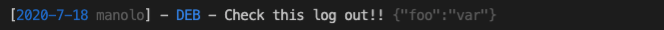
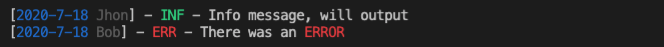

<div align="center">
  


[![NPM Version][npm-image]][npm-url]
[![Downloads][downloads-badge]][downloads-link]
[![Dependencies][dependencies-badge]][dependencies-link]
[![Known Vulnerabilities][vulnerabilities-badge]][vulnerabilities-link]  
[](https://www.codefactor.io/repository/github/loggin-js/loggin-js)
[![NPM Package Size][pkg-size-badge]][pkg-size-link] <!-- ALL-CONTRIBUTORS-BADGE:START - Do not remove or modify this section -->
[](#contributors-)

<!-- ALL-CONTRIBUTORS-BADGE:END -->

An easy and customizable logger for NodeJS.  

---

[`🔧 Demo`][demo]
[`📓 Wiki`][wiki]  
[`🔗 Logger`][docs:logger]
[`🔗 Notifier`][docs:notifier]
[`🔗 Log`][docs:log]
[`🔗 Severity`][docs:severity]
[`🔗 Formatter`][docs:formatter]  
[`🔗 .logger`][docs:helper:logger]
[`🔗 .notifier`][docs:helper:notifier]
[`🔗 .severity`][docs:helper:severity]
[`🔗 .formatter`][docs:helper:formatter]

</div>

---

## News <!-- omit in toc -->

- **Browser** support has been **deprecated** as of version `2.0.0`. I you want you can find the latest release with browser support [here]()

## Features
- **Extensible**
- **Lightweighted**
- **Configure log message** & **colored** output
- **File notifier**
- **Http notifier**
- **Memory notifier**: store in memory and output on demand
- **Log levels**: log some stuff as DEBUG, INFO, or just ERRORS, etc...

## Table Of Content <!-- omit in toc -->
- [Features](#features)
  - [Installing](#installing)
  - [Importing](#importing)
- [Getting Started](#getting-started)
- [Examples](#examples)
- [Plugins](#plugins)
- [Contributing](#contributing)

Usefull links:

- [Migrating to `v2.x`](https://github.com/loggin-js/loggin-js/wiki/Migrating-to-%60v2.x%60)
- [Custom Loggers](https://github.com/loggin-js/loggin-js/wiki/Getting-Started#creating-custom-loggers)

### Installing

```bash
$ npm i loggin-js
# or
$ yarn add loggin-js
```

### Importing

```js
const loggin = require('loggin-js');
// Or
import * as loggin from 'loggin-js';
```

## Getting Started

The default logger is the simplest way to use Loggin'JS.

```js
loggin.debug('Check this debug message out!!');
loggin.error('Check this error out!!');
loggin.alert('Check this alert out!!');
```



Or if you want to have more control you can create a custom logger, as follows:

```js
const logger = loggin.logger({
  level: loggin.severity('info'),
  channel: 'demo-1',
  formatter: 'long',
});
```
* `level` defines which logs are outputted.
* `channel` specifies the scope/context/origin of this log, ie: `file-loader`, `kernel`
* `formatter` how will the log be formatted before outputting it
  * There are some formatters available, like `json`, `short`, `medium`  

After creating a custom logger you can use it as the default one:
```js
logger.user('Jhon');
logger.color(true);

logger.debug('Debug message, will not output');
logger.info('Info message, will output');
```

You can also override options when calling `.log` or any default methods (ie: debug, info, etc...)
```js
logger.error('There was an <%rERROR>', null, { user: 'Bob' });
```



**Output channels**

In addition to loggin to the console, you can also log to a file:

```js
const fileNotifier = loggin.notifier('file');
const logger = loggin.logger().notifier(fileNotifier);
```

Defining different files per type of log:
```js
fileNotifier
  .pipe(loggin.severity('error'), './error.log'))
  .pipe(loggin.severity('debug'), './debug.log'));
```

Default Notifiers available:
- `file`
- `console`
- `http`
- `memory`

Chek out the [wiki](https://github.com/loggin-js/loggin-js/wiki) for a more detailed guide.

[back to top](#table-of-content-)

---

## Examples

Here are some usage examples:

- [Basic Example](https://runkit.com/nombrekeff/loggin-js-demo-1)
- [File Notifier](https://runkit.com/nombrekeff/loggin-js-file-notifier)
- [Multiple Notifiers](https://runkit.com/nombrekeff/multiple-notifiers)
- [Http Notifier](https://runkit.com/nombrekeff/loggin-js-remote-notifier)
- You can also check the [`examples`](./examples) for more examples.

> If you want to add an example or find some error, leave an issue or send in a PR.

## Plugins

- [MongoDB](https://github.com/loggin-js/loggin-js-mongodb)
- [Express](https://github.com/loggin-js/loggin-js-express)
- [WebSocket](https://github.com/loggin-js/loggin-js-ws)

Coming:

- Telegram
- Mail - maybe?
- Sentry, and similar
- ...

## Coverage <!-- omit in toc -->

![Coverage][coverage-lines-badge]
![Coverage][coverage-functions-badge]
![Coverage][coverage-statements-badge]
![Coverage][coverage-branches-badge]

## Contributing

> First off, thank you for considering contributing to Loggin'JS.

Please read [CONTRIBUTING.md](./.github/CONTRIBUTING.md) for details on our code of conduct, and the process for submitting pull requests.
There is also a public [slack channel](https://loggin-js.slack.com/archives/CT05VPRRC) available.

### Contributors ✨ <!-- omit in toc -->

_Initial work_ by [nombrekeff](https://github.com/nombrekeff)

Thanks goes to these wonderful people ([emoji key](https://allcontributors.org/docs/en/emoji-key)):

<!-- ALL-CONTRIBUTORS-LIST:START - Do not remove or modify this section -->
<!-- prettier-ignore-start -->
<!-- markdownlint-disable -->
<table>
  <tr>
    <td align="center"><a href="https://github.com/nombrekeff"><br /><sub><b>Manolo Edge</b></sub></a><br /><a href="https://github.com/loggin-js/loggin-js/commits?author=nombrekeff" title="Code">💻</a> <a href="#ideas-nombrekeff" title="Ideas, Planning, & Feedback">🤔</a> <a href="#maintenance-nombrekeff" title="Maintenance">🚧</a> <a href="https://github.com/loggin-js/loggin-js/commits?author=nombrekeff" title="Tests">⚠️</a></td>
    <td align="center"><a href="https://github.com/floki-gh"><br /><sub><b>Floki</b></sub></a><br /><a href="https://github.com/loggin-js/loggin-js/commits?author=floki-gh" title="Documentation">📖</a></td>
  </tr>
</table>

<!-- markdownlint-enable -->
<!-- prettier-ignore-end -->

<!-- ALL-CONTRIBUTORS-LIST:END -->

This project follows the [all-contributors](https://github.com/all-contributors/all-contributors) specification. Contributions of any kind welcome!

## License <!-- omit in toc -->

This project is licensed under the MIT License - see the [LICENSE.md](LICENSE.md) file for details.

<!-- Links -->

[npm-image]: https://img.shields.io/npm/v/loggin-js.svg?style=flat-square
[npm-url]: https://npmjs.org/package/loggin-js
[demo]: https://runkit.com/nombrekeff/loggin-js-demo-1
[wiki]: https://github.com/loggin-js/loggin-js/wiki
[travis-image]: https://img.shields.io/travis/nombrekeff/loggin-js.svg?style=flat-square
[travis-url]: https://travis-ci.org/nombrekeff/loggin-js
[code-quality-badge]: http://npm.packagequality.com/shield/loggin-js.svg?style=flat-square
[code-quality-link]: https://packagequality.com/#?package=loggin-js
[pkg-size-badge]: https://img.shields.io/bundlephobia/minzip/loggin-js?style=flat-square
[pkg-size-link]: https://bundlephobia.com/result?p=loggin-js
[downloads-badge]: https://img.shields.io/npm/dm/loggin-js.svg?style=flat-square
[downloads-link]: https://www.npmjs.com/package/loggin-js
[dependencies-badge]: https://img.shields.io/david/nombrekeff/loggin-js.svg?style=flat-square
[dependencies-link]: https://david-dm.org/nombrekeff/loggin-js?view=tree
[vulnerabilities-badge]: https://snyk.io/test/npm/loggin-js/badge.svg?style=flat-square
[vulnerabilities-link]: https://snyk.io/test/npm/loggin-js
[coverage-lines-badge]: ./.github/badges/badge-lines.svg
[coverage-functions-badge]: ./.github/badges/badge-functions.svg
[coverage-branches-badge]: ./.github/badges/badge-branches.svg
[coverage-statements-badge]: ./.github/badges/badge-statements.svg
[docs:severity]: https://github.com/loggin-js/loggin-js/wiki/Severity
[docs:notifier]: https://github.com/loggin-js/loggin-js/wiki/Notifier
[docs:formatter]: https://github.com/loggin-js/loggin-js/wiki/Formatter
[docs:formatting]: https://github.com/loggin-js/loggin-js/wiki/Formatter
[docs:log]: https://github.com/loggin-js/loggin-js/wiki/Log
[docs:logger]: https://github.com/loggin-js/loggin-js/wiki/Logger
[docs:channel]: https://github.com/loggin-js/loggin-js/wiki/Logger#channel
[docs:logger-options]: https://github.com/loggin-js/loggin-js/wiki/Logger#options
[docs:helper:logger]: https://github.com/loggin-js/loggin-js/wiki/Helpers#logger
[docs:helper:notifier]: https://github.com/loggin-js/loggin-js/wiki/Helper#notifier
[docs:helper:formatter]: https://github.com/loggin-js/loggin-js/wiki/Helper#formatter
[docs:helper:severity]: https://github.com/loggin-js/loggin-js/wiki/Helper#severity
[docs:customizing]: https://github.com/loggin-js/loggin-js/wiki/logger#customizing
[docs:premades]: https://github.com/loggin-js/loggin-js/wiki/premades
[docs:plugins]: https://github.com/loggin-js/loggin-js/wiki/Plugins
